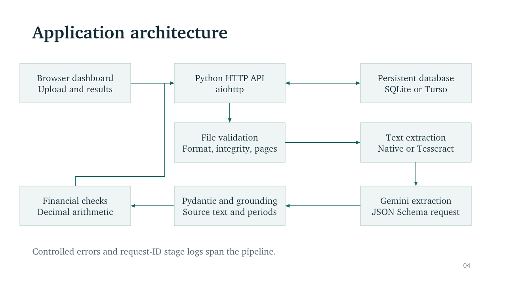

# Document Intelligence

A Python application for uploading financial documents, extracting page-aware text,
requesting structured AI output, checking financial arithmetic, and retaining results
in a database-backed HTML dashboard. It supports invoices, balance sheets, profit and
loss statements, and cash-flow statements in PDF, JPG and PNG format, up to three pages.

**Verification status:** the application and tests run locally. Real OCR was run on
all 50 supplied documents. Four annotated reference responses were replayed through
the real OCR, API, grounding and financial-check pipeline. Those replays substitute
the model and do **not** demonstrate Gemini accuracy. No API key or deployment account
was available, so live AI extraction and public deployment remain unverified. See
[the requirement audit](docs/compliance_audit.md) and [verification report](docs/verification.md).

## Problem and scope

Financial documents have different layouts, comparative columns and number formats.
The application separates file integrity, text recognition, semantic extraction and
arithmetic so a failure in one stage remains understandable. Every stored result can
be retrieved by its filename. The dashboard reads the server database on each refresh.

This is a single-user assessment prototype. It does not include authentication,
multi-tenant isolation or a job queue. Do not use its public dashboard for private
documents: anyone who can reach it can view saved results.

## Architecture and technology choices



| Technology | Purpose and reason |
| --- | --- |
| Python 3.12 and aiohttp | One asynchronous HTTP server serves uploads, APIs and static frontend files. aiohttp was already installed in the build environment; FastAPI installation was blocked by network policy. The official case study permits another suitable Python framework. |
| Pydantic 2 | Validates provider output and the stable response contract; generates OpenAPI response schemas. |
| PyMuPDF | Checks PDFs, extracts embedded words with positions and renders scanned pages. |
| Pillow and Tesseract | Local image preparation and OCR without an OCR API account. |
| Gemini REST API | Requests complete structured semantic extraction. The configured model is `gemini-2.5-flash`; no live invocation was possible during this build. |
| Decimal | Performs reproducible financial arithmetic without binary floating-point equality. |
| SQLite or Turso | SQLite provides local persistence. Turso exposes compatible SQL over HTTPS for hosts with ephemeral disks. |
| Plain HTML, CSS and JavaScript | Upload form, persisted document list, evidence, tables, calculations and raw JSON with no frontend build step. |

Provider contracts were checked against the official [Gemini model documentation](https://ai.google.dev/gemini-api/docs/models/gemini-2.5-flash),
[structured-output guidance](https://ai.google.dev/gemini-api/docs/structured-output),
[aiohttp documentation](https://docs.aiohttp.org/en/stable/web_quickstart.html) and
[Turso HTTP protocol](https://docs.turso.tech/sdk/http/quickstart). Provider request
tests use a fake transport; they cannot establish current account entitlement or live compatibility.

## Project structure

```text
backend/app/
  main.py                         HTTP server and application lifecycle
  api/openapi.py                  OpenAPI 3.1 specification
  api/routes/documents.py         Upload, get, list and health handlers
  core/                          Settings, logging, errors and database adapter
  schemas/                       Provider and API Pydantic models
  services/                      File validation, OCR, AI grounding and arithmetic
  repositories/                  Parameterized document persistence
  utils/numbers.py               Conservative decimal parsing
backend/tests/                   Unit, HTTP and OCR integration tests
backend/tests/fixtures/          Clearly labelled source-backed reference responses
frontend/templates/             Dashboard and API documentation
frontend/static/                CSS and JavaScript
scripts/                        Dataset evaluation, local smoke and reference replay
docs/                           Architecture, presentation, deployment and audit
sample_outputs/                 Actual OCR/API records and labelled reference runs
```

## Local setup

Install Python 3.12 and Tesseract, including English language data. On Ubuntu:

```bash
sudo apt-get update
sudo apt-get install -y tesseract-ocr tesseract-ocr-eng
python3 -m venv .venv
source .venv/bin/activate
python -m pip install -r requirements.txt
cp .env.example .env
```

On macOS, `brew install tesseract` supplies the OCR engine. On Windows, install
Tesseract and put its installation directory on `PATH`; activate the virtual
environment with `.venv\Scripts\activate`. Set `GEMINI_API_KEY` in `.env` to a key
from your own Gemini account. Never put the key in JavaScript, Git or screenshots.
The program reads `.env`; environment variables already set by the host take precedence.

From the project root:

```bash
python -m backend.app.main
```

Open [the local dashboard](http://localhost:8000), [API documentation](http://localhost:8000/docs),
[OpenAPI schema](http://localhost:8000/openapi.json) and [health check](http://localhost:8000/api/v1/health).
The frontend is served by the same process and uses relative API URLs. No frontend
startup command or production localhost rewrite is needed.

Alternatively, with Docker installed:

```bash
cp .env.example .env
# Edit .env with your model key before starting.
docker compose up --build
```

The Compose volume retains SQLite data. The Docker image was authored but could
not be built in this workspace because Docker and package-registry access were unavailable.

## Configuration

| Variable | Default | Purpose |
| --- | --- | --- |
| `GEMINI_API_KEY` | Empty | Required for actual structured AI extraction. |
| `LLM_MODEL` | `gemini-2.5-flash` | Gemini model supporting JSON Schema output. |
| `HOST` / `PORT` | `0.0.0.0` / `8000` | HTTP bind address; hosting platform `PORT` is honored. |
| `DATABASE_BACKEND` | `sqlite` | Choose `sqlite` or `turso`. |
| `DATABASE_PATH` | `data/documents.sqlite3` under project root | Local SQLite file. |
| `TURSO_DATABASE_URL` | Empty | Required for Turso, using `libsql://` or `https://`. |
| `TURSO_AUTH_TOKEN` | Empty | Required for Turso; secret. |
| `FINANCIAL_TOLERANCE` | `0.05` | Absolute tolerance in the source's displayed units. |
| `OCR_LANGUAGE` / `OCR_DPI` | `eng` / `220` | Tesseract language and PDF render resolution. |
| `OCR_TIMEOUT_SECONDS` | `40` | Timeout per recognition attempt. Weak images can require multiple attempts. |
| `LLM_TIMEOUT_SECONDS` | `120` | Model request timeout. |
| `MAX_CONCURRENT_DOCUMENTS` | `1` | Limits simultaneous OCR/model pipelines. |
| `MAX_UPLOAD_BYTES` | `15728640` | 15 MiB maximum uploaded file size. |
| `MAX_IMAGE_PIXELS` | `30000000` | Caps image/PDF-page rendering memory. |
| `MAX_PAGES` | `3` | Can be reduced, cannot exceed the assessment limit. |
| `MAX_TEXT_CHARS` | `100000` | Rejects excessively large extracted text without truncation. |
| `MAX_MODEL_RESPONSE_BYTES` | `4194304` | Caps provider response size. |
| `ALLOWED_ORIGINS` | Empty | Optional comma-separated exact CORS origins; same-origin UI needs none. |

## File validation and OCR

The validator checks extension, declared MIME, actual signature, empty/oversize
uploads, PDF structure, encrypted PDFs, readable pages, page count, image decoding
and pixel limits. It rejects repaired/truncated PDFs and animated images. Generic
`application/octet-stream` is accepted only when signature and extension agree.
Filenames are decoded, stripped of directory components and sanitized. Uploads
remain in memory within the size limit; OCR intermediates use temporary directories
that are deleted automatically.

For each PDF page, usable native text is selected first. Otherwise the page is
rendered and sent to Tesseract. Images receive EXIF orientation, bounded resizing
and grayscale contrast preparation. Word positions preserve larger column gaps.
Weak OCR triggers an orientation comparison and, if needed, an alternate page
segmentation mode. An OSD rotation is accepted only if recognition quality improves.
Page text and the selected method remain in processing metadata.

Tesseract mean word confidence is recorded as an OCR diagnostic. It is **not** an
extraction confidence score or proof of financial accuracy. Values below 80 produce
a review warning; below 50 prevent an overall processing PASS. No arbitrary model
confidence score is emitted.

## Structured extraction and grounding

The model receives page-delimited text and a Pydantic-derived JSON schema. The
prompt asks for all visible fields, original labels, notes, line items, table cells
and reporting periods. It explicitly prohibits calculations, invented missing values,
external knowledge and following instructions inside source documents.

The wire format uses extensible field arrays instead of a narrow minimum-only
schema. The API exposes `fields` as key-value objects, separate `periods` for
comparative data, `line_items`, and tables with named columns. Minimum keys are
added with `value: null` where absent. Missing invoice currency is not inferred
from a seller address. Dates keep the original printed order; ambiguous dates are
not converted to an assumed locale.

Each accepted value must have a quote found on its claimed page and a complete
raw token found inside that quote. Unsupported values become null with a reason
and a grounding warning. Duplicate/conflicting fields, unknown periods, inconsistent
columns, malformed JSON and incomplete provider responses fail in a controlled way.
One enclosing JSON code fence can be removed; malformed JSON is never reconstructed
by guessing. Grounding verifies OCR-text support, not semantic label correctness
or the source image. Live model completeness still needs measurement.

`value` preserves the printed string. `numeric_value` is a canonical decimal
string, which avoids losing monetary precision in JSON. Consumers can parse it as
a decimal. Unknown values are JSON `null`, never the string `"null"`.

## Financial validation

Every check returns its name, period, formula, operands, calculated/reported values,
variance, tolerance, status and any reason it could not run. Variance is calculated
minus reported. Checks pass when absolute variance is at most the configured
absolute tolerance, default 0.05. For statements in crore, 0.05 means 0.05 crore;
values are not silently converted to rupees. No relative tolerance is used.

| Document | Implemented checks |
| --- | --- |
| Invoice | Quantity × unit price against an explicitly net line amount; complete net-line sum against subtotal; exclusive-tax subtotal/taxable amount plus tax and explicit adjustments against total; cash paid minus total against change. |
| Balance sheet | Capital and liabilities against assets, or liabilities plus equity when separate totals exist; complete non-overlapping component sums, independently per period. |
| Profit and loss | Interest earned plus other income; expenditure components; profit before minority interest; group net profit; available profit for appropriation with explicitly reported adjustments; general gross/operating-profit checks where their operands exist. |
| Cash flow | Operating plus investing plus financing plus reported FX adjustment against net change; opening plus net change plus explicitly shown acquisition/other adjustments against closing, per period. |

Missing required operands yield `NOT_APPLICABLE`. An absent FX adjustment is not
replaced with zero. A printed dash remains unknown. Taxes already included in a
total are not added again. Unknown net/gross basis prevents misleading line checks.
The simple quantity × price check is skipped when line discounts make that formula
inapplicable; the source values remain available for review.

Number parsing supports unambiguous decimal commas, grouping commas, currency
symbols/codes, negative signs, bracketed negatives, Indian grouping and percentages
in percentage fields. A lone `1,250` is ambiguous without a justified document
separator convention and can remain null. No OCR digit substitutions are guessed.

Financial overall status is FAIL if any check fails; otherwise PASS if at least
one passes; otherwise NOT_APPLICABLE. Processing PASS additionally requires
completed extraction, no rejected grounding, and adequate page text. Arithmetic
FAIL, no evaluable checks, very weak OCR or incomplete page text produces processing
FAILED with retained results. `extraction_completed` distinguishes successful
extraction needing review from an OCR/model failure.

## API

| Method | Endpoint | Purpose |
| --- | --- | --- |
| POST | `/api/v1/documents/process` | Multipart `file` and `document_type`; 201 for a processed stored result, including a financial failure. |
| GET | `/api/v1/documents/{document_name}` | Latest result for that sanitized filename; 404 if absent. |
| GET | `/api/v1/documents` | Database-backed listing; `q`, `limit` 1–100 and `offset` supported. |
| GET | `/api/v1/health` | Server/database health and OCR/model configuration flags. |

The health endpoint does not make a paid model call. `?ready=true` returns 503
when the OCR engine or model key is missing. A configured key alone does not verify
the provider credentials. Swagger UI at `/docs` uses a versioned CDN bundle;
the local endpoint reference and `/openapi.json` remain available without the CDN.

```bash
curl -F 'file=@invoice.jpg' -F 'document_type=invoice' \
  http://localhost:8000/api/v1/documents/process

curl 'http://localhost:8000/api/v1/documents/invoice.jpg'
curl 'http://localhost:8000/api/v1/documents?limit=20&offset=0'
curl 'http://localhost:8000/api/v1/health'
```

Use the returned `document_name` for retrieval and URL-encode spaces and punctuation.
The response has `document_name`, `document_type`, `processing_status`,
`file_validation`, `extracted_data`, `validation` and `processing_metadata`.
See the actual [reference invoice response](sample_outputs/reference_runs/invoice.json)
for a source-backed example, with its fixture-replay provenance clearly identified.

Errors consistently contain `error.code`, `error.message`, `processing_status`
and a request ID. After processing begins, successfully persisted failures also
include `result` with any recovered page text. HTTP codes include 400 for corrupt
input, 413 for size limits, 415 for unsupported types, 422 for invalid fields or
unreadable text, 429 when the processor is occupied, 502 for invalid model output,
503 for dependency failures and 504 for downstream timeouts. Raw exception text
and stack traces are not returned.

## Persistence and logging

The repository writes one JSON result and indexed summary columns per sanitized
filename using a parameterized upsert. Reprocessing replaces that name's latest
result, including a later failure. Earlier versions are not retained. A new database
connection/process can retrieve the same records. SQLite uses WAL mode and a busy
timeout; a persistent disk or external Turso database is required on ephemeral hosts.

Logs contain JSON events for request receipt, file validation, OCR, extraction,
financial checks, database writes, completion and controlled failure. Request IDs
connect the stages. Logs omit document bodies, provider responses and secret values.
Stored results do include OCR text and extracted document information.

## Tests and sample evaluation

```bash
python -m unittest discover -s backend/tests -t . -v
python scripts/local_smoke.py --dataset 'New Dataset 1.zip'
python scripts/evaluate_dataset.py 'New Dataset 1.zip' --output sample_outputs/ocr_run
python scripts/evaluate_dataset.py 'New Dataset 1.zip' --api http://localhost:8000 \
  --per-category 1 --output sample_outputs/live_run
python scripts/replay_references.py 'New Dataset 1.zip'
```

Unit/HTTP tests are deterministic and use synthetic model responses. OCR integration
tests actually invoke Tesseract on generated PNG and scanned PDF pages. The local
smoke script starts the production entrypoint and verifies HTTP routes plus results
surviving a process restart. Without a model key, it expects and saves real controlled
503 responses rather than manufacturing successful extractions.

The dataset is not duplicated in this repository. Supply the original ZIP to the
scripts. `sample_outputs/ocr_run` contains actual OCR records for all 50 documents.
`reference_runs` uses source-backed annotated fixtures for all four types and
explicitly records `live_model_invocation: false`. Reference runs are regression
examples, not a live extraction-accuracy benchmark.

The browser smoke script requires Playwright and Chromium:

```bash
npm install --no-save playwright@1.58.2
npx playwright install chromium
node scripts/browser_smoke.mjs
```

These are test-only Node dependencies. The application itself has no Node dependency.
The script tests upload, result display, raw JSON, reload, search and mobile width
against a separate synthetic test server. Chromium was absent here, so browser
interaction/rendering has not been verified. The workflow in `.github/workflows/tests.yml`
runs these checks when pushed to a GitHub environment with network access.

## Deployment

See [exact deployment steps](docs/deployment.md). `render.yaml` selects a Docker
web service and external Turso persistence. Free Render services lose local files
on restarts and cannot attach a persistent disk; the database must live elsewhere.
This is why the free-hosting configuration does not use local SQLite.
[Render free-service documentation](https://render.com/docs/free).

| Submission URL | Verified status |
| --- | --- |
| Public GitHub repository | Not created or pushed; GitHub access was blocked. |
| Frontend URL | Not deployed. |
| Backend base URL | Not deployed. |
| Swagger URL | Not deployed; local `/docs` is implemented. |
| Health URL | Not deployed; local health checks passed. |

## Known limitations and production improvements

Live Gemini quality, provider schema compatibility, Turso connectivity, Docker build
and public deployment need execution in an authorized environment. Browser UI checks
also remain outstanding. The project must not be described as a completed deployed
submission until those gates pass.

OCR errors remain in faint receipts, slanted photographs, unusual symbols and dense
tables. Text grounding cannot repair an OCR mistake. Statement year association and
semantic field selection still depend on the model. Financial validation does not
prove that all fields are correct or complete. Detailed discount/tax allocation and
all accounting conventions are outside the deterministic rules implemented here.

For production, add authentication and tenant isolation, retention controls, an
auditable human-review workflow, object storage with source-page coordinates, a
labelled evaluation set, calibrated quality thresholds, rate limiting per account,
background jobs and stronger preprocessing for skewed images. Keep model retries
bounded and explicit; the prototype returns a clear error rather than silently
spending more on repeated provider calls.

## AI tool declaration and interview walkthrough

OpenAI Codex/ChatGPT was used to interpret the supplied requirements, inspect sample
documents, write the implementation and tests, annotate source-backed reference
fixtures, diagnose OCR orientation and filename-encoding failures, and prepare
documentation and slides. Tesseract and PyMuPDF performed the recorded OCR/text runs.
No live Gemini API call was made during development in this workspace.

In the interview, demonstrate one scan and the native cash-flow PDF; inspect the
returned evidence; explain comparative periods and Decimal arithmetic; show a missing
operand and a failed calculation; retrieve a document after restart; and explain
what model grounding can and cannot establish. Use the presentation in `docs/`.
